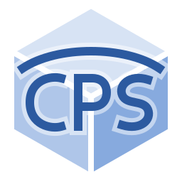

# Common Package Specification (CPS)

The **Common Package Specification (CPS)** is an open specification for describing software packages and their dependencies in a language-agnostic, tool-agnostic, and platform-agnostic way. CPS aims to provide a unified, extensible, and machine-readable format for package metadata, making it easier to share, build, and consume libraries across diverse build systems and environments.

## Key Features

- **Standardized Format:** Simple, declarative YAML or JSON for package metadata, dependencies, build flags, and more.
- **Language & Tool Agnostic:** Works with C, C++, Rust, Python, and various build systems (CMake, Meson, Bazel, etc.).
- **Dependency Management:** Specifies direct and transitive dependencies, version constraints, and features.
- **Extensible:** Supports custom fields and extensions.
- **Open Ecosystem:** Enables interoperability between package managers, build tools, and CI/CD systems.

## Example

A minimal `foo.cps` file:
```yaml
cps_version: "0.9"
name: foo
version: "1.2.3"
description: "A sample library"
requires:
  - bar >=1.0
  - baz
libs:
  - foo
cflags:
  - -I${prefix}/include
ldflags:
  - -L${prefix}/lib
  - -lfoo
```

## Documentation

- The full specification, guides, and examples are available at [https://cps-org.github.io/cps/](https://cps-org.github.io/cps/).
- Documentation can be generated using [Sphinx](https://www.sphinx-doc.org/), but Sphinx is not required.

## Getting Started

1. **Write a `.cps` file** for your library or application.
2. **Distribute** the `.cps` file alongside your package or in a central registry.
3. **Consume** CPS files in your build system using a compatible tool or script.

## Ecosystem

- [cps](https://github.com/cps-org/cps): Reference implementation and tools.
- [Documentation](https://cps-org.github.io/cps/): Full specification, guides, and examples.

## Contributing

Contributions are welcome! Please see [CONTRIBUTING.md](CONTRIBUTING.md) for guidelines.

## License

See [LICENSE](LICENSE) for details.

---

For more information, visit the [CPS website](https://cps-org.github.io/cps/) or join the discussion on [GitHub](https://github.com/cps-org/cps).
